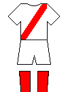

# footballkit

Go module that will render images of football kits given an English description.

NOTE:

This module is mainly designed to support local (small) club teams and is used by
our web page for showing possible strip clashes. It is not particularly accurate
if attempting to render 'famous' club strips, though I have given a few examples
here of our nearest approximation.

### Monash University Soccer Club (pre 2018)

`RenderImage("body stripes skyblue white shorts navy socks navy")`

### Manchester United

`RenderImage("body red shorts white socks black")`

### Aston Villa

`RenderImage("body claret shorts white socks light blue")`

### Celtic

`RenderImage("hoops green white shorts white socks green")`

### Peru

`RenderImage("leftsash red white shorts white socks white")`

### Croatia

`RenderImage("checks red white shorts white socks blue")`

